# Best Local LLM Hardware 2025 - Under $3000

> [!summary] TL;DR - Top Picks by Use Case
> - **Best Overall Value**: RTX 3090 (used, $800-900) - 112 tok/s, 24GB VRAM
> - **Best Performance**: RTX 5090 ($1,999) - 213 tok/s, 32GB VRAM
> - **Best Budget**: Intel Arc B580 ($249) - 62 tok/s, 12GB VRAM
> - **Best for 70B+ Models**: AMD Ryzen AI Max+ 395 128GB ($2,000) - 43 tok/s, 128GB RAM
> - **Best Power Efficiency**: Apple M4 Pro ($1,399+) - 44 tok/s, ultra-quiet

## Overview

This comprehensive guide analyzes the best hardware for local #LLM inference in 2025, focusing on **tokens/second per dollar** under $3,000 budget based on the latest reviews from tech YouTubers and hardware reviewers.

**Last Updated**: 2025-11-05

---

## Complete Hardware Comparison

### Desktop GPU Options

| GPU | Price | VRAM | 8B tok/s | 32B tok/s | 70B tok/s | Tok/$ (8B) | Power | Rating |
|-----|-------|------|----------|-----------|-----------|------------|-------|--------|
| **RTX 5090** | $1,999 | 32GB | 213 | 61 | ~20-25 | **0.107** | 450W | ⭐⭐⭐⭐⭐ |
| **RTX 4090** | $1,500-1,800 | 24GB | 128 | ~40 | ~12-15 | **0.071-0.085** | 450W | ⭐⭐⭐⭐⭐ |
| **RTX 3090** | $800-900 (used) | 24GB | 112 | ~35 | ~10-12 | **0.124-0.140** 🏆 | 350W | ⭐⭐⭐⭐⭐ |
| **RTX 4060 Ti 16GB** | $499 | 16GB | 100 | ~25 | N/A | **0.200** | 160W | ⭐⭐⭐⭐ |
| **RTX 5070** | $620-750 | 12GB | 100 | ~20 | N/A | **0.133-0.161** | 220W | ⭐⭐⭐⭐ |
| **Intel Arc B580** | $249 | 12GB | 62 | ~15 | N/A | **0.249** 💎 | 190W | ⭐⭐⭐⭐ |

> [!success] Best Performance/$ Winner
> **Intel Arc B580** at 0.249 tokens/sec per dollar is unbeatable for budget builds, though limited to smaller models by 12GB VRAM.

### Integrated/APU Options

| System | Price | RAM | 7B tok/s | 32B tok/s | 70B tok/s | Tok/$ (7B) | Power | Rating |
|--------|-------|-----|----------|-----------|-----------|------------|-------|--------|
| **AMD Ryzen AI Max+ 128GB** | $2,000 | 128GB | 43-61 | 10.58 | 5.1 | **0.0215-0.031** | 170W | ⭐⭐⭐⭐⭐ |
| **AMD Ryzen AI Max+ 64GB** | $1,499 | 64GB | 43 | 10.58 | N/A | **0.0287** | 170W | ⭐⭐⭐⭐ |
| **M4 Pro Mac Mini 64GB** | $2,399 | 64GB | 44 | ~12 | N/A | **0.0183** | 47W | ⭐⭐⭐ |
| **M4 Max (laptop)** | $3,000+ | 128GB | 96-100 | ~30-35 | ~10-12 | **0.032-0.033** | 80W | ⭐⭐⭐ |
| **M4 Mac Mini (base)** | $599-799 | 16-24GB | 21 | N/A | N/A | **0.026-0.035** | 31W | ⭐⭐⭐ |

> [!info] APU Advantage
> APU/SoC systems like AMD Ryzen AI Max+ and Apple Silicon offer **unified/large RAM pools** for running 70B+ models that won't fit on single GPUs.

---

## Detailed Analysis by Price Point

### Under $500 - Budget Champions

#### 🥇 Intel Arc B580 - $249

> [!tip] Best Budget Pick
> Unbeatable performance per dollar for experimentation and development.

**Performance:**
- 62 tokens/second on 7B models
- 12GB VRAM (limits to ~30B models max)
- **0.249 tokens/sec per dollar** - highest ratio in guide

**Best For:**
- Learning and experimentation
- Development with 7B-13B models
- Budget-conscious builders
- Secondary/testing machine

**Limitations:**
- ⚠️ 12GB VRAM limits model size
- ⚠️ Driver maturity still improving
- ⚠️ Less ecosystem support than NVIDIA

**Total Cost:** ~$500-700 (with basic system)

---

#### 🥈 RTX 4060 Ti 16GB - $499

**Performance:**
- 100 tokens/second on 8B models
- 16GB VRAM (good for up to 32B Q4 models)
- **0.200 tokens/sec per dollar**

**Best For:**
- Serious hobbyists
- 32B model users
- Balanced performance/cost

**Advantages:**
- ✅ CUDA ecosystem maturity
- ✅ 16GB handles most useful models
- ✅ Lower power (160W vs 350W+)
- ✅ Excellent driver support

**Total Cost:** ~$800-1,000 (with basic system)

---

### $800-1,500 - Value Sweet Spot

#### 🏆 RTX 3090 (Used) - $800-900

> [!success] Overall Value Champion
> The best tokens/dollar for a 24GB card. Used market makes this unbeatable.

**Performance:**
- 112 tokens/second on 8B models
- 35+ tokens/second on 32B models
- 10-12 tokens/second on 70B models
- **0.124-0.140 tokens/sec per dollar**

**Best For:**
- Maximum value per dollar
- Users comfortable with used hardware
- Running 70B models
- Production workloads

**Why It Wins:**
- ✅ 24GB VRAM (same as RTX 4090)
- ✅ Excellent performance
- ✅ Half the price of RTX 4090
- ✅ Proven reliability
- ✅ Can run 70B Q4 models

**Considerations:**
- ⚠️ Used market only (no warranty)
- ⚠️ Higher power draw (350W)
- ⚠️ Older architecture

**Total Cost:** ~$1,100-1,400 (with basic system)

> [!example] Real-World Example
> RTX 3090 at $850 delivers 112 tok/s = **$7.59 per token/sec**
> Compare to RTX 4090 at $1,700 delivering 128 tok/s = **$13.28 per token/sec**
>
> RTX 3090 is **75% cheaper per token** despite being only 12% slower!

---

### $1,500-2,000 - High Performance

#### 🔥 AMD Ryzen AI Max+ 395 (128GB) - $2,000

> [!success] Best for Large Models
> Only option under $3K that handles 70B+ models comfortably.

**Performance:**
- 43-61 tokens/second on 7B models
- 10.58 tokens/second on 32B models
- 5.1 tokens/second on 70B models
- **Can load 120B models** (2.26-11.9 tok/s depending on config)

**Best For:**
- Running 70B+ models
- Users who need large context
- All-in-one mini PC solution
- Future-proofing

**Advantages:**
- ✅ 128GB total RAM (96GB for GPU)
- ✅ Complete system (mini PC)
- ✅ Upgradeable storage
- ✅ ROCm support coming (20-40% boost expected)
- ✅ SD card reader
- ✅ Compact form factor

**Considerations:**
- ⚠️ Higher power (170W)
- ⚠️ Currently using Vulkan (ROCm pending)
- ⚠️ Static memory partitioning
- ⚠️ Lower tok/s than discrete GPUs on small models

**Related:** [[The BEST Mini PC EVER MADE - AMD Ryzen AI 395+ MAX BENCHMARKED]]

---

#### ⚡ RTX 5090 - $1,999

> [!success] Best Raw Performance
> Fastest consumer GPU for LLM inference. New architecture, huge memory bandwidth.

**Performance:**
- 213 tokens/second on 8B models (67% faster than RTX 4090)
- 61 tokens/second on 32B models
- 20-25 tokens/second on 70B models (estimated)
- **10,400+ tokens/second** prompt processing (Qwen3 8B)
- **0.107 tokens/sec per dollar**

**Technical Specs:**
- 32GB GDDR7 VRAM
- 1.79 TB/s memory bandwidth (77% more than 4090)
- 450W TDP

**Best For:**
- Maximum performance
- Professional/production use
- Running many models efficiently
- Future-proofing

**Advantages:**
- ✅ Fastest consumer GPU
- ✅ 32GB VRAM (8GB more than 4090)
- ✅ Massive memory bandwidth
- ✅ Best for batch processing
- ✅ New architecture

**Considerations:**
- ⚠️ $2,000 price point
- ⚠️ 450W power consumption
- ⚠️ May be hard to find (stock issues)
- ⚠️ Requires substantial PSU (850W+)

**Total Cost:** ~$2,500-2,800 (with system)

---

#### RTX 4090 - $1,500-1,800

**Performance:**
- 128 tokens/second on 8B models
- 40 tokens/second on 32B models
- 12-15 tokens/second on 70B models
- **0.071-0.085 tokens/sec per dollar**

**Best For:**
- Users who want current-gen
- Don't want used hardware
- Need reliability and warranty

**Advantages:**
- ✅ 24GB VRAM
- ✅ Proven reliability
- ✅ Wide availability
- ✅ Mature drivers
- ✅ Excellent CUDA support

**Considerations:**
- ⚠️ Expensive for performance vs 3090
- ⚠️ Being phased out for 5090
- ⚠️ 450W power consumption

**Total Cost:** ~$2,200-2,500 (with system)

---

### $2,000-3,000 - Premium Options

#### Apple M4 Pro Mac Mini (64GB) - $2,399

**Performance:**
- 44 tokens/second on 7B models
- 11-12 tokens/second on 32B models
- **0.0183 tokens/sec per dollar**

**Best For:**
- MacOS users
- Power efficiency priority
- Quiet operation
- macOS/iOS development

**Advantages:**
- ✅ Ultra power efficient (47W)
- ✅ Silent operation
- ✅ Unified memory architecture
- ✅ Compact form factor
- ✅ Great for general computing too

**Considerations:**
- ⚠️ Cannot run 70B models (64GB limit)
- ⚠️ More expensive per token
- ⚠️ macOS only
- ⚠️ Not upgradeable

---

#### M4 Max MacBook Pro (128GB) - $3,000+

**Performance:**
- 96-100 tokens/second on 8B models
- 30-35 tokens/second on 32B models
- 10-12 tokens/second on 70B models
- **0.032-0.033 tokens/sec per dollar**

**Best For:**
- MacOS users who need portability
- Video editing + LLM work
- Apple ecosystem users
- Power efficiency priority

**Advantages:**
- ✅ Portable
- ✅ 128GB unified memory
- ✅ 546 GB/s memory bandwidth
- ✅ 40-80W power consumption
- ✅ Can run 70B models
- ✅ Excellent for content creation

**Considerations:**
- ⚠️ Expensive ($3,000-5,000)
- ⚠️ Over budget for most
- ⚠️ macOS only
- ⚠️ Not upgradeable

---

## Recommendations by Use Case

### 🎯 Best Overall Value: RTX 3090 (Used) - $800-900

> [!success] Winner for Most Users
>
> **Why it wins:**
> - 0.124-0.140 tokens/sec per dollar (best 24GB option)
> - Can run 70B models
> - Proven reliability
> - Huge used market availability

**Who should buy:**
- Anyone comfortable with used hardware
- Users who need 70B model support
- Budget-conscious professionals
- Home lab enthusiasts

**Complete build cost:** ~$1,100-1,400

---

### 🏆 Best Raw Performance: RTX 5090 - $1,999

> [!tip] For Maximum Speed
>
> **Why it wins:**
> - 213 tok/s on 8B models
> - 32GB VRAM
> - Future-proof architecture
> - Massive bandwidth

**Who should buy:**
- Professionals
- Production deployments
- Users who run many models
- Future-proofing priority

**Complete build cost:** ~$2,500-2,800

---

### 💎 Best Budget: Intel Arc B580 - $249

> [!tip] For Experimentation
>
> **Why it wins:**
> - 0.249 tokens/sec per dollar (highest ratio)
> - 62 tok/s for $249
> - Great for learning
> - Low entry cost

**Who should buy:**
- Beginners
- Developers testing models
- Secondary machines
- Budget learners

**Complete build cost:** ~$500-700

---

### 🔮 Best for Large Models: AMD Ryzen AI Max+ 128GB - $2,000

> [!success] For 70B+ Models
>
> **Why it wins:**
> - Only option that handles 70B+ models well under $3K
> - 128GB total RAM
> - Complete mini PC system
> - Future ROCm support

**Who should buy:**
- Users who need 70B+ models
- Want all-in-one solution
- Prefer mini PC form factor
- Future-proofing matters

**Complete system cost:** $2,000 (includes everything)

---

### ⚡ Best Power Efficiency: M4 Pro Mac Mini - $1,399+

> [!tip] For Low Power Users
>
> **Why it wins:**
> - Only 47W power draw
> - Silent operation
> - Good performance
> - Compact

**Who should buy:**
- macOS users
- Power bill matters
- Quiet operation priority
- Want general-purpose machine too

**Complete system cost:** $1,399-2,399

---

## Decision Matrix

```mermaid
graph TD
    A[What's your budget?] --> B{Under $500?}
    B -->|Yes| C[Intel Arc B580 💎]
    B -->|No| D{Under $1000?}
    D -->|Yes| E{Comfortable with used?}
    E -->|Yes| F[RTX 3090 Used 🏆]
    E -->|No| G[RTX 4060 Ti 16GB]
    D -->|No| H{Under $2000?}
    H -->|Yes| I{Need 70B models?}
    I -->|Yes| J[AMD Ryzen 128GB]
    I -->|No| K[RTX 3090 or wait for deals]
    H -->|No| L{Under $3000?}
    L -->|Yes| M{Priority?}
    M -->|Performance| N[RTX 5090 ⚡]
    M -->|70B+ Models| O[AMD Ryzen 128GB]
    M -->|Mac User| P[M4 Pro Mac Mini]
    M -->|Portable| Q[M4 Max MacBook]
    L -->|No| R[Consider RTX 5090 or save money]
```

---

## Complete Build Costs

### Budget Build (~$500-700)
- Intel Arc B580: $249
- Basic system: $250-450
- **Total: $500-700**
- **Performance: 62 tok/s**

### Value Build (~$1,100-1,400)
- RTX 3090 (used): $800-900
- Decent system: $300-500
- **Total: $1,100-1,400**
- **Performance: 112 tok/s, 24GB VRAM**

### High-Performance Build (~$2,200-2,500)
- RTX 4090: $1,500-1,800
- Good system: $700-700
- **Total: $2,200-2,500**
- **Performance: 128 tok/s, 24GB VRAM**

### Enthusiast Build (~$2,500-2,800)
- RTX 5090: $1,999
- Good system: $500-800
- **Total: $2,500-2,800**
- **Performance: 213 tok/s, 32GB VRAM**

### All-in-One Mini PC (~$2,000)
- AMD Ryzen AI Max+ 128GB: $2,000
- **Total: $2,000 (complete system)**
- **Performance: 43-61 tok/s, 128GB RAM, runs 70B models**

### Apple Solutions
- M4 Mac Mini (base): $599 (21 tok/s, 16GB)
- M4 Pro Mac Mini (64GB): $2,399 (44 tok/s, 64GB)
- M4 Max MacBook (128GB): $3,000-5,000 (96-100 tok/s, 128GB)

---

## Power Consumption Comparison

| Hardware | Idle | Load | Annual Cost* | Efficiency |
|----------|------|------|--------------|------------|
| Intel Arc B580 | 30W | 190W | ~$166/yr | ⭐⭐⭐⭐ |
| RTX 4060 Ti | 20W | 160W | ~$140/yr | ⭐⭐⭐⭐⭐ |
| RTX 3090 | 35W | 350W | ~$307/yr | ⭐⭐⭐ |
| RTX 4090 | 40W | 450W | ~$394/yr | ⭐⭐ |
| RTX 5090 | 40W | 450W | ~$394/yr | ⭐⭐ |
| AMD Ryzen 128GB | 30W | 170W | ~$149/yr | ⭐⭐⭐⭐ |
| M4 Mac Mini | 10W | 31W | ~$27/yr | ⭐⭐⭐⭐⭐ |
| M4 Pro Mac Mini | 15W | 47W | ~$41/yr | ⭐⭐⭐⭐⭐ |

*Assuming $0.12/kWh, 8hrs daily use

> [!info] Power Savings
> Over 3 years, M4 Mac Mini saves **$1,100** in electricity vs RTX 4090!

---

## Model Size Capabilities

| Hardware | 7B | 13B | 32B | 70B | 120B+ |
|----------|----|----|-----|-----|-------|
| Arc B580 (12GB) | ✅ | ✅ | ⚠️ | ❌ | ❌ |
| RTX 4060 Ti (16GB) | ✅ | ✅ | ✅ | ❌ | ❌ |
| RTX 3090 (24GB) | ✅ | ✅ | ✅ | ✅ | ❌ |
| RTX 4090 (24GB) | ✅ | ✅ | ✅ | ✅ | ❌ |
| RTX 5090 (32GB) | ✅ | ✅ | ✅ | ✅ | ⚠️ |
| AMD 128GB | ✅ | ✅ | ✅ | ✅ | ✅ |
| M4 Pro 64GB | ✅ | ✅ | ✅ | ⚠️ | ❌ |
| M4 Max 128GB | ✅ | ✅ | ✅ | ✅ | ✅ |

**Legend:**
- ✅ Runs well (>10 tok/s)
- ⚠️ Runs slowly or requires optimization
- ❌ Cannot fit in memory

---

## Future-Proofing Considerations

### Will Get Better
- **AMD Ryzen AI Max+**: ROCm support expected to boost performance 20-40%
- **Intel Arc B580**: Driver improvements ongoing
- **RTX 5090**: New architecture, long support ahead

### Already Mature
- **RTX 3090/4090**: Proven, but older architecture
- **Apple Silicon**: Excellent now, incremental improvements expected

### Risk Factors
- ⚠️ Model sizes keep growing (7B → 70B → 200B+ trend)
- ⚠️ Quantization techniques improving (may reduce VRAM needs)
- ⚠️ New architectures may bring big jumps

---

## Action Items

- [ ] Determine your typical model size needs (7B, 32B, 70B?)
- [ ] Calculate your power costs ($0.12/kWh typical)
- [ ] Check used market for RTX 3090 availability
- [ ] Consider ROI timeframe (1yr, 3yr, 5yr?)
- [ ] Factor in noise/heat tolerance
- [ ] Decide on form factor preference (desktop vs mini PC)

---

## Quick Recommendations

### "I want the best value"
→ **RTX 3090 (used) at $800-900** - 0.124-0.140 tok/$/s, 24GB, runs 70B models

### "I want maximum performance"
→ **RTX 5090 at $1,999** - 213 tok/s, 32GB, fastest available

### "I'm on a tight budget"
→ **Intel Arc B580 at $249** - 0.249 tok/$/s, great for learning

### "I need to run 70B+ models"
→ **AMD Ryzen AI Max+ 128GB at $2,000** - Only option under $3K for large models

### "I care about power efficiency"
→ **M4 Pro Mac Mini at $1,399+** - 47W, silent, excellent all-rounder

### "I want a balanced option"
→ **RTX 4060 Ti 16GB at $499** - 0.200 tok/$/s, 16GB, runs 32B well

---

## Comparison to Cloud APIs

### Cost Break-Even Analysis

**Cloud API Costs (typical):**
- GPT-4: ~$0.01-0.03 per 1K tokens
- Claude Sonnet: ~$0.003 per 1K tokens
- Llama 3 70B (together.ai): ~$0.0009 per 1K tokens

**Break-even calculations (100K tokens/day):**

| Hardware | Cost | Tokens/day | API equivalent | Payback period |
|----------|------|-----------|----------------|----------------|
| Arc B580 | $700 | 100K | ~$90/mo | **7.8 months** |
| RTX 3090 | $1,400 | 100K | ~$90/mo | **15.5 months** |
| RTX 5090 | $2,800 | 100K | ~$90/mo | **31 months** |
| AMD 128GB | $2,000 | 100K | ~$90/mo | **22 months** |

> [!tip] When to Buy vs Rent
> If you process >50K tokens/day consistently, hardware pays for itself in 1-2 years.

---

## Related Resources

### Related Notes
- [[The BEST Mini PC EVER MADE - AMD Ryzen AI 395+ MAX BENCHMARKED]]
- [[Nvidia You're Late - World's First 128GB LLM Mini Is Here]]
- [[LLM-inference-comparison]]

### Additional Topics
#hardware-comparison #GPU #buying-guide #cost-optimization #performance-benchmarks #2025

---

## Sources & Research

This guide synthesizes data from:
- Hardware-Corner GPU Rankings for LLMs
- LocalLLM.in GPU Comparisons
- Runpod RTX 5090 LLM Benchmarks
- AMD Ryzen AI Max+ Official Benchmarks
- Apple Silicon LLM Performance Analysis
- Introl Local LLM Hardware Guide 2025
- Real-world testing from tech YouTubers
- Community benchmarks (Level1Techs, Framework forums)

**Research Date:** November 2025
**Market Prices:** As of November 2025

---

## Changelog

**2025-11-05**: Initial comprehensive guide created
- Added RTX 5090 benchmarks
- Included AMD Ryzen AI Max+ data
- Added M4 series comparisons
- Compiled real-world performance data

---

## Metadata

**Created:** 2025-11-05
**Last Updated:** 2025-11-05
**Status:** #complete
**Type:** #buying-guide #hardware-comparison
**Category:** #LLM #local-AI #GPU
**Budget:** Under $3,000
