# LLM Inference Hardware Comparison

> [!summary] TL;DR
> **Best Choice:** GMKTec EVO-X2 128GB at $2,000
> - Best token/cost ratio for 70B models
> - 2x cheaper than Mac alternatives
> - Future ROCm support will improve performance
> - Can run models up to 120B parameters

## Overview

This analysis compares local #LLM inference performance on a token/cost basis for the #GMKTech EVO-X2 mini PC configurations vs #Apple Mac Mini M4 Pro.

**Analysis Date:** 2025-11-05

### Related Reviews
- [[The BEST Mini PC EVER MADE - AMD Ryzen AI 395+ MAX BENCHMARKED]]
- [[Nvidia You're Late - World's First 128GB LLM Mini Is Here]]

---

## Hardware Options

### GMKTec EVO-X2 Specifications

| Specification | Details |
|--------------|---------|
| **CPU** | AMD Ryzen AI Max Plus 395 (16 cores/32 threads, up to 5.1GHz) |
| **GPU** | Radeon 8060S (rival to RTX 4060) |
| **Memory** | LPDDR5X @ 8000MHz (64GB or 128GB) |
| **Architecture** | Static partitioning (memory split between CPU/GPU) |
| **Power** | 120W max (CPU+GPU), 230W power brick |
| **Storage** | Dual PCIe Gen 4 SSD slots (up to 16TB) |
| **Connectivity** | 2x USB 4, 5x USB-A, SD card, HDMI, DisplayPort, 2.5Gbps Ethernet, Wi-Fi 7 |

> [!info] Memory Configuration
> The memory can be split between system and GPU. Common configurations:
> - 64GB/64GB split (balanced)
> - 96GB GPU / 32GB system (maximum LLM performance)

### Apple Mac Mini M4 Pro

| Specification | Details |
|--------------|---------|
| **CPU** | M4 Pro (more cores than base M4) |
| **Memory** | Unified memory architecture (64GB tested) |
| **Memory Bandwidth** | 273 GB/s |
| **Power** | 47W during inference |

---

## Performance Benchmarks

### GMKTec EVO-X2 (128GB) - $2,000

| Model Size | Model Type | Tokens/Second | Power Draw | Notes |
|------------|-----------|---------------|------------|-------|
| 7B | DeepSeek R1 Distill Q4 | 43 tok/sec | ~170W | #fast |
| 32B | Qwen 32B Q4 | 10.58 tok/sec | ~170W | #practical-sweet-spot |
| 70B | Llama 3.3 70B Q4 | 5.1 tok/sec | 170-174W | #usable |
| 120B | Large model | 2.26-11.9 tok/sec | 82W+82W | #struggled |

> [!tip] Optimal Use Case
> The 32B models at 10.58 tok/sec offer the best balance of capability and speed for serious work.

### M4 Pro Mac Mini (64GB) - $2,399

| Model Size | Model Type | Tokens/Second | Power Draw |
|------------|-----------|---------------|------------|
| 7B | DeepSeek R1 Distill Q4 | 44 tok/sec | 47W |

> [!success] Power Efficiency Winner
> Mac Mini uses only 47W vs 170W for GMKTec, making it 3.6x more power efficient.

### M4 Mac Mini (Base) - Price varies

| Model Size | Model Type | Tokens/Second | Power Draw |
|------------|-----------|---------------|------------|
| 7B | DeepSeek R1 Distill Q4 | 21 tok/sec | 31W |

---

## Token/Cost Analysis

### GMKTec EVO-X2 (128GB) - $2,000
- **Small models (7B)**: 43 tok/sec → **0.0215 tokens/sec per dollar** #efficiency
- **Medium models (32B)**: 10.58 tok/sec → **0.00529 tokens/sec per dollar**
- **Large models (70B)**: 5.1 tok/sec → **0.00255 tokens/sec per dollar**

### GMKTec EVO-X2 (64GB) - $1,499
- **Small models (7B)**: ~43 tok/sec → **0.0287 tokens/sec per dollar** ⭐ #best-efficiency
- **Medium models (32B)**: ~10.58 tok/sec → **0.00706 tokens/sec per dollar**
- **Limited to models up to ~30B parameters** ⚠️

### M4 Pro Mac Mini (64GB) - $2,399
- **Small models (7B)**: 44 tok/sec → **0.0183 tokens/sec per dollar**

### M4 Mac Mini (Base) - Price varies
- **Small models (7B)**: 21 tok/sec → **~0.03-0.035 tokens/sec per dollar** (estimated)

> [!warning] Mac Mini Limitation
> M4 Pro Mac Mini maxes out at 64GB, preventing 70B+ model inference.

---

## Memory Bandwidth Comparison

| Device | Published | Measured (Stream) | Impact | #performance |
|--------|-----------|-------------------|---------|---------------|
| AMD Ryzen AI Max Plus | 256 GB/s | 120 GB/s | Fast inference for 32B+ models | ⚡ |
| M4 Mac Mini | 120 GB/s | 96 GB/s | Good for small models | ✓ |
| M4 Pro Mac Mini | 273 GB/s | 209 GB/s | Competitive with AMD | ⚡ |
| Nvidia DGX Spark | 279 GB/s | TBD | Expected competitor | 🔜 |

> [!note] Memory Bandwidth Mystery
> The AMD chip measures lower (120 GB/s) than published specs (256 GB/s) via Stream benchmark, yet achieves excellent practical performance. This suggests either:
> - Benchmark methodology differences
> - Potential for optimization with future ROCm support

---

## Power Efficiency

| Device | Power Draw (7B) | Tokens per Watt | Winner |
|--------|----------------|-----------------|--------|
| GMKTec EVO-X2 | ~170W | 0.25 tok/W | |
| M4 Mac Mini | 31W | 0.68 tok/W | ⭐ |
| M4 Pro Mac Mini | 47W | 0.94 tok/W | 🏆 |

> [!info] Power Consideration
> Mac Minis are significantly more power-efficient (3-7x better), but the GMKTec offers much larger model capacity. Choose based on your priority: efficiency vs capability.

---

## Recommendation

> [!success] Best Choice: GMKTec EVO-X2 128GB ($2,000)
> This configuration offers the best overall value for local LLM inference.

### Reasons:

#### 1. Best Overall Value #value
- ✅ Ability to run 70B models (5.1 tok/sec)
- ✅ Comfortable headroom for 32B models (10.58 tok/sec)
- ✅ Future-proofing for larger models
- ✅ Half the cost of comparable Mac options ($5,000 for MacBook M4 Max with 128GB)

#### 2. Practical Performance #performance
- 32B models (10.58 tok/sec) offer the best balance of capability and speed
- 70B models are usable at 5.1 tok/sec
- No need for cloud API costs for large models

#### 3. Future Improvements #roadmap
- [[ROCm]] support coming for AMD chips
- Could significantly boost performance 20-40% beyond current Vulkan implementation
- Currently using Vulcan with cross-platform overhead

#### 4. Cost Analysis #budget
- $500 premium over 64GB version buys access to 70B+ models
- Cannot be achieved on the 64GB version at any price
- Far cheaper than Mac alternatives

---

### Alternative: GMKTec EVO-X2 64GB ($1,499)

> [!tip] Choose the 64GB version if:
> - [ ] You only plan to run models under 30B parameters
> - [ ] Better tokens/dollar efficiency matters (0.0287 vs 0.0215 for 7B models)
> - [ ] Tighter budget constraint
> - [ ] Power consumption is less critical

> [!warning] Skip the 64GB version if:
> - [ ] You need 70B+ model support
> - [ ] Future-proofing is important
> - [ ] You want to run state-of-the-art models

---

### Skip: M4 Pro Mac Mini ($2,399)

> [!failure] Not Recommended for LLM Focus
> While excellent for general use, it's not the best choice for dedicated LLM work.

**Reasons:**
- Similar performance to GMKTec for small models
- Cannot run 70B models (64GB limitation)
- $399 more expensive than GMKTec 128GB
- Better power efficiency but limited by 64GB max RAM

---

## Additional Considerations

### ✅ Pros of GMKTec EVO-X2

- Upgradeable storage (dual M.2 slots)
- Full-size SD card reader (useful for creators)
- Extensive port selection
- Can be configured for 96GB GPU / 32GB system split for max LLM performance
- Windows/Linux flexibility
- Better for running 32B+ models

### ❌ Cons of GMKTec EVO-X2

- Higher power consumption (~170W vs 31-47W for Mac)
- Larger physical size than Mac Mini
- Static memory partitioning (less flexible than unified memory)
- ROCm support still pending (currently using Vulkan)
- May run hot under sustained load
- Noisier operation under load

### ✅ Pros of Mac Mini

- Excellent power efficiency #green
- Superior unified memory architecture
- Smaller form factor
- Better for video editing (M4 Max beats GMKTec significantly)
- Quieter operation
- Better macOS integration
- Lower heat output

### ❌ Cons of Mac Mini

- Limited to smaller models (64GB max on M4 Pro)
- More expensive for equivalent RAM
- Not upgradeable
- Cannot run 70B+ models
- Higher cost per GB of RAM

---

## Cost Comparison Summary

| Configuration | Price | 70B Support | Tokens/$ (7B) | Tokens/$ (32B) | Rating |
|--------------|-------|-------------|---------------|----------------|--------|
| GMKTec 128GB | $2,000 | ✅ Yes | 0.0215 | 0.00529 | ⭐⭐⭐⭐⭐ |
| GMKTec 64GB | $1,499 | ❌ No | 0.0287 | 0.00706 | ⭐⭐⭐⭐ |
| M4 Pro 64GB | $2,399 | ❌ No | 0.0183 | N/A | ⭐⭐⭐ |
| MacBook M4 Max 128GB | $5,000 | ✅ Yes | ~0.0098 | ~0.0025 | ⭐⭐ |

> [!example] Value Calculation
> The $500 premium for 128GB over 64GB buys you:
> - Access to 70B models (impossible on 64GB)
> - Future-proofing for model growth
> - ROI if you avoid just 50 hours of cloud API costs

---

## Conclusion

> [!success] Final Recommendation
> **For local LLM inference on a token/cost basis, the GMKTec EVO-X2 128GB at $2,000 is the clear winner.**

The ability to run 70B models for half the price of Mac alternatives, combined with strong 32B performance (the practical sweet spot for most work), makes it an excellent choice for serious local LLM inference work.

The upcoming [[ROCm]] support could further improve performance by 20-40%, making this an even better investment.

### Decision Matrix

```mermaid
graph TD
    A[Need Local LLM?] --> B{Budget?}
    B -->|Under $1500| C[GMKTec 64GB]
    B -->|Under $2500| D{Model Size?}
    D -->|< 30B| C
    D -->|> 32B| E[GMKTec 128GB ⭐]
    B -->|Unlimited| F{Priority?}
    F -->|Power Efficiency| G[Mac Mini M4 Pro]
    F -->|Model Size| H[GMKTec 128GB ⭐]
```

---

## Action Items

- [ ] Check current GMKTec availability and pricing
- [ ] Monitor [[ROCm]] support announcements from AMD
- [ ] Compare electricity costs: 170W vs 47W for your usage
- [ ] Consider future model size requirements
- [ ] Evaluate if 70B models are necessary for your use case

---

## Related Topics

#hardware-comparison #AI-infrastructure #cost-optimization #performance-benchmarks #local-inference

### See Also
- [[The BEST Mini PC EVER MADE - AMD Ryzen AI 395+ MAX BENCHMARKED]]
- [[Nvidia You're Late - World's First 128GB LLM Mini Is Here]]

---

## Sources

- Tech Notice Review: https://www.youtube.com/watch?v=UDHRo5Kqoxk
  - See: [[The BEST Mini PC EVER MADE - AMD Ryzen AI 395+ MAX BENCHMARKED]]
- Alex Ziskind Review: https://www.youtube.com/watch?v=B7GDr-VFuEo
  - See: [[Nvidia You're Late - World's First 128GB LLM Mini Is Here]]

---

## Metadata

**Created:** 2025-11-05
**Last Updated:** 2025-11-05
**Status:** #complete
**Type:** #analysis #hardware-comparison
**Category:** #LLM #local-AI
